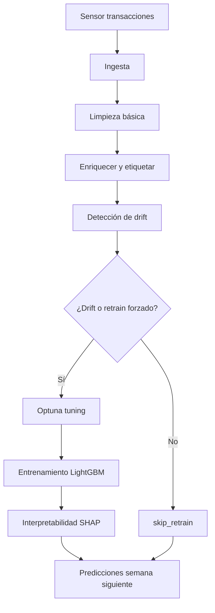

# Documentación del DAG `data_extraction_pipeline`

## 1. Descripción general
Este DAG orquesta el pipeline de MLOps que va desde la ingesta de los `parquet` diarios hasta la generación de predicciones y artefactos de interpretabilidad. Corre a diario (`@daily`), sin `catchup`, y usa sensores para garantizar que existan archivos nuevos antes de procesar. Cada paso expone logs y `XComs`, de modo que Airflow puede reintentar tareas aisladas o reanudar el flujo desde cualquier punto.

## 2. Tareas y dependencias
| Orden | `task_id` | Descripción |
| --- | --- | --- |
| 1 | `wait_for_transacciones` | Sensor que monitorea `data/incoming/transacciones*.parquet` y desbloquea el DAG sólo cuando hay archivos. |
| 2 | `ingest_data` | Copia el último `transacciones*.parquet` hacia `data/raw/<ds>` preservando el nombre y registrando la ruta en `XCom`. |
| 3 | `transform_data` | Limpia duplicados/nulos, valida columnas mínimas y genera `transacciones_clean.parquet` en `data/processed/<ds>`. |
| 4 | `enrich_and_label` | Crea la etiqueta `compra`, balancea clases, enriquece con `clientes`/`productos` y guarda `transacciones_enriched.parquet`. |
| 5 | `detect_drift` | Calcula PSI numérico/categórico vs. referencia (`data/reference/transacciones_clean.parquet`) y decide si hay `drift_detected`. |
| 6 | `branch_retrain` | `BranchPythonOperator` que envía el flujo a `tune_model` cuando hay drift o se cumple la periodicidad (`force_retrain_every`). Si no, ejecuta `skip_retrain`. |
| 7 | `tune_model` | Usa Optuna + LightGBM para encontrar hiperparámetros; publica los mejores en `XCom` y loggea resultados en MLflow. |
| 8 | `train_model` | Entrena el modelo final, registra métricas (`f1`, `roc_auc`, `accuracy`), guarda `models/latest_model.pkl` y sube artefactos a MLflow. |
| 9 | `interpret_model` | Calcula explicaciones SHAP (importancias y dependencias) y almacena gráficos en `models/shap_artifacts`. Devuelve una ruta o `interpretation_failed` para permitir que el DAG continúe. |
| 10 | `skip_retrain` | Tarea dummy que facilita la rama “no reentrenar”. Se conecta a `predict_next_week` para que ésta se ejecute aunque la rama paralela haya sido omitida. |
| 11 | `predict_next_week` | Genera probabilidades de compra para la semana siguiente usando los registros más recientes, guarda resultados en `data/predictions/<ds>` y expone métricas en MLflow. Su `trigger_rule` garantiza la ejecución incluso si `skip_retrain` queda en `skipped`. |

Dependencias en Airflow:
```
wait_for_transacciones >> ingest_data >> transform_data >> enrich_and_label >> detect_drift >> branch_retrain
branch_retrain >> [tune_model, skip_retrain]
tune_model >> train_model >> interpret_model >> predict_next_week
skip_retrain >> predict_next_week
```

## 3. Diagrama de flujo 


## 4. Visualización del DAG en Airflow
- Desde la UI (`http://localhost:8080`) seleccione `data_extraction_pipeline` y abra la vista *Graph*. Allí se observa la misma estructura descrita arriba junto con los estados de cada tarea.
- Si se requiere un artefacto estático, Airflow puede renderizarlo ejecutando:
  ```bash
  source .venv/bin/activate
  export AIRFLOW_HOME=~/airflow
  export AIRFLOW__CORE__DAGS_FOLDER=$(pwd)/dags
  airflow dags show data_extraction_pipeline --save dags/docs/dag_structure.png
  ```
  (Requiere `graphviz`/`pydot` instalados; el archivo queda disponible en `dags/docs/dag_structure.png`).

## 5. Lógica para nuevos datos, drift y retraining
- **Integración de datos futuros**: la estructura `data/incoming` admite nuevos `parquet` sin modificar código. El sensor y `ingest_data` siempre operan con el archivo más reciente, por lo que basta con dejar los nuevos lotes en esa carpeta para que el DAG se ejecute en cuanto los detecte.
- **Detección de drift**: `detect_drift` calcula PSI por columna numérica/categórica comparando contra un dataset de referencia. Si la métrica supera `0.2`, se considera drift y se activa el reentrenamiento. Si no existe referencia, se inicializa copiando el primer dataset procesado.
- **Retraining periódico**: aun sin drift, la tarea `_should_retrain` fuerza un reentrenamiento cada `force_retrain_every` ejecuciones, controlado por Variables de Airflow. Esto evita quedar “congelados” en un modelo antiguo aunque no se detecte drift estadístico.
- **Predicciones continuas**: `predict_next_week` usa siempre la última semana disponible y guarda los resultados versionados por fecha (`data/predictions/<ds>`), lo que facilita comparar runs históricos.
- **MLflow + artefactos**: cada entrenamiento y predicción sube parámetros, métricas y archivos a `mlruns`, asegurando trazabilidad completa.

